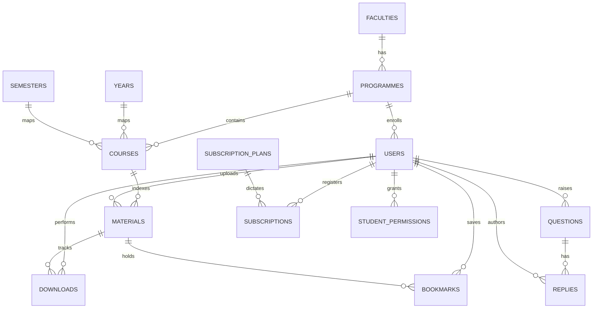
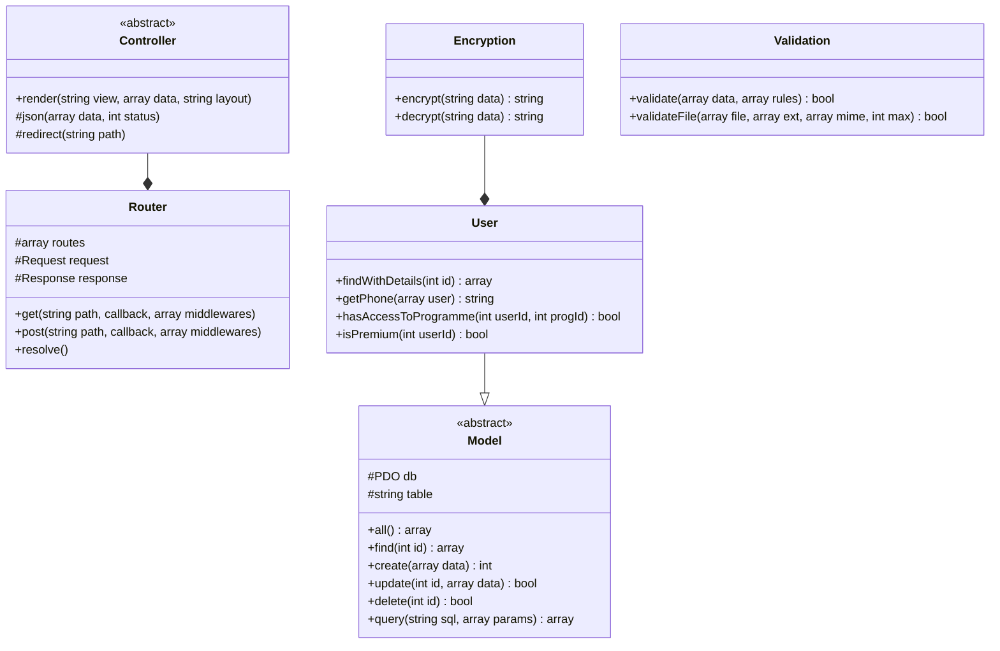
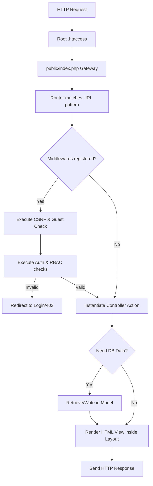

# SmartHUB Digital Library - Technical & Academic Documentation

## 1. Problem Statement
In modern higher education, access to course materials is frequently scattered across various media: personal folders, email attachments, flash drives, and unorganized cloud links. This fragmentation makes it difficult for students to retrieve textbooks, past papers, notes, and lab sheets relevant to their curriculum. Furthermore, universities must enforce academic boundaries—ensuring that students registered in specific majors (e.g., BIT) can only access their relevant curriculum files unless granted explicit privileges. This requires a centralized, secure, role-based, and highly structured digital repository.

## 2. Project Objectives
- **Centralize Learning Resources**: Develop a single academic repository mapping resources to specific faculties, programmes, years, semesters, and courses.
- **Implement Boundary Control**: Restrict student access to enrolled programme materials, allowing administrators to manage permissions or verify subscriptions for external study.
- **Apply Academic Architecture**: Build a customized MVC structure from scratch in PHP 8+ without third-party frameworks.
- **Ensure Database Normalization**: Model the database structure to Third Normal Form (3NF) with strict transactional constraints.
- **Enforce Security Best Practices**: Incorporate PDO statements, CSRF shields, output escaping, OpenSSL encryption for sensitive data, and detailed audit trails.

## 3. System Scope
- **Faculties & Courses CRUD**: Admin tools to manage the curriculum hierarchy.
- **Safe Material Cataloging**: Validate uploads for size (50MB), whitelist formats (PDF, DOCX, ZIP, etc.), and block duplicates using MD5 checksums.
- **Student Dashboard**: Browse curriculum courses, search files, download resources, and bookmark selections.
- **Help Desk (Q&A Board)**: Support ticket thread communication between students and admin.
- **Reports & Backups**: Analytics tab with Excel exports, print layouts, and database SQL backups.

---

## 4. System UML Diagrams

### Use Case Diagram
```mermaid
left-to-right direction
actor Guest
actor Student
actor Administrator

rectangle "SmartHUB Digital Library" {
    Guest --> (Browse Homepage)
    Guest --> (Register & Login)
    
    Student --> (Browse Curriculum Courses)
    Student --> (Download Files)
    Student --> (Bookmark Materials)
    Student --> (Raise Help Desk Question)
    Student --> (Purchase Subscription Upgrade)
    
    Administrator --> (Manage Faculties & Programmes)
    Administrator --> (Manage Courses & Upload Files)
    Administrator --> (Moderate Users & Permissions)
    Administrator --> (View Analytics & Export Reports)
    Administrator --> (Generate SQL Database Backups)
    Administrator --> (Reply Student Questions)
}
```

### Entity-Relationship Diagram (3NF)


### Class Structure Diagram


### Flowchart: Request Processing and RBAC Middleware


---

## 5. Third Normal Form (3NF) Schema Design
Database tables strictly adhere to 3NF. Multi-valued dependencies are isolated (1NF), all columns depend on their primary key (2NF), and transitive dependencies are eliminated (3NF).
- **Users**: Relies on `subscription_plans` and `programmes` lookup IDs. User sensitive phone data is stored as a raw encrypted ciphertext string to prevent access leakages.
- **Student Permissions**: A junction lookup table bridging `users` and `programmes` to override enrollment boundaries without changing core entities.
- **Materials**: Contains size, file hash, category, course association, and uploader tracking.

---

## 6. Security Framework Details
- **PDO Prepared Statements**: Emulate prepares is disabled (`PDO::ATTR_EMULATE_PREPARES => false`). Every database input is parameterized to eliminate SQL injections.
- **Phone Encryption**: Sensitive mobile fields are encrypted via `openssl_encrypt()` using `AES-256-CBC` with an initialization vector (IV) prepended to the ciphertext and base64 encoded.
- **CSRF Token Guards**: All state-changing actions (POST requests) check if the submitted token matches the cryptographic hash cached in `$_SESSION['csrf_token']`.
- **Output Escaping**: Views render inputs wrapped inside `Helper::esc()` which maps strings to safe entities via `htmlspecialchars(str, ENT_QUOTES, 'UTF-8')`.
- **RBAC Filters**: Specific route endpoints execute `AdminMiddleware` or `AuthMiddleware` checking roles prior to rendering actions.

---

## 7. Installation Guide

### Prerequisites
- **Web Server**: Apache (XAMPP / WAMP / LAMP)
- **PHP Version**: 8.0 or higher (with `openssl` and `pdo_mysql` extensions enabled)
- **Database**: MySQL 5.7+ / MariaDB

### Steps
1. **Clone Workspace**: Place the `SmartHUB` directory in your server document root (e.g. `C:\xampp\htdocs\SMARTHUB`).
2. **Review DB Port**: Ensure XAMPP MySQL is active. If your MySQL runs on a non-standard port (e.g., 3307), make sure `DB_PORT` in `app/config/config.php` matches it:
   ```php
   define('DB_PORT', '3307');
   ```
3. **Database Seeding**: Run the automated installer using CLI to create the database, tables, and seed mockup data:
   ```bash
   C:\xampp\php\php.exe database/seed.php
   ```
4. **Access the App**: Open your browser and navigate to `http://localhost/SMARTHUB/`. The root `.htaccess` will automatically rewrite and direct your browser to the web portal.

### Seed Accounts
- **Administrator**: `admin@smarthub.edu` / Password: `AdminPassword123`
- **Student**: `student@smarthub.edu` / Password: `StudentPassword123`

---

## 8. Deployment Guide (AWS EC2 / RDS)
1. **Launch RDS MySQL Instance**: Configure a MySQL 8.0 db instance on Amazon RDS. Ensure the Security Group allows inbound traffic from your EC2 instance.
2. **Launch EC2 Instance**: Deploy an EC2 instance running Ubuntu 22.04 LTS.
3. **Install LAMP Stack**:
   ```bash
   sudo apt update
   sudo apt install apache2 php php-mysql php-xml php-mbstring libapache2-mod-php -y
   sudo a2enmod rewrite
   sudo systemctl restart apache2
   ```
4. **Migrate Project**: Clone the repository to `/var/www/html/SMARTHUB`. Assign directory ownership:
   ```bash
   sudo chown -R www-data:www-data /var/www/html/SMARTHUB/
   sudo chmod -R 755 /var/www/html/SMARTHUB/
   ```
5. **Adjust Server Configs**: Modify `/app/config/config.php` setting `DB_HOST` to your RDS endpoint address, updating password parameters, and checking the port value (default 3306 on RDS).
6. **Import DB schema**: Execute the migrations on your RDS database.
